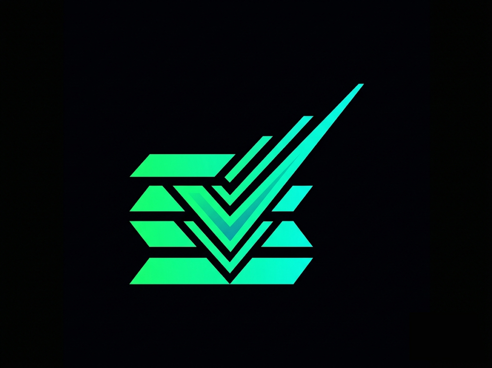

# AnnexIV-Solana-Core: Автономный комплаенс и архитектура доверия для эры ИИ 🛡️
<p align="center">
  
</p>

<h1 align="center">AnnexIV-Solana-Core</h1>

<p align="center">
  <strong>The Infrastructure Standard for AI Compliance on Solana</strong>
</p>

🌟 **[Pitch Deck (Презентация)](#)** | 🎥 **[Live Demo Video](#)** [](#)
[](#)
[](#)
[](#)
[](#)
[](#)

## 1. Elevator Pitch 🚀
**AnnexIV-Solana-Core** — это инфраструктурный стандарт для автоматизации регуляторного комплаенса в рамках **EU AI Act**. Мы используем высокопроизводительную сеть Solana и децентрализованное хранилище IPFS для создания неизменяемого аудиторского следа процесса обучения и эксплуатации моделей ИИ.

Наше решение трансформирует статические юридические требования Annex IV в динамический процесс **Compliance-as-Code**. Система "перехватывает" телеметрию прямо во время обучения нейросети (Loss/Bias), автономно анализирует её через мультиагентную RAG-архитектуру (Llama 3.3 70B), выносит вердикт безопасности (Trust Score) и фиксирует статус on-chain. 

Это исключает риск человеческой ошибки, защищает бизнес от экзистенциальных штрафов до €35 млн и позволяет в 1 клик сгенерировать юридически значимый PDF-сертификат для регулятора.

---

## 2. Ключевые фичи (Hackathon MVP) 🔥
Мы не просто написали концепт, мы реализовали End-to-End процесс:

1. 🧠 **Live ML Integration:** Скрипт-адаптер (`demo_ml_training.py`) интегрируется напрямую в процесс обучения реальной нейросети (`scikit-learn` MLPClassifier) и транслирует метрики предвзятости (Bias) в реальном времени.
2. 🔗 **100% Web3 Proof:** Никаких локальных моков. Все JSON-отчеты о безопасности ИИ автоматически хешируются и загружаются в глобальную децентрализованную сеть **IPFS через Pinata**, возвращая криптографический CID.
3. 🛑 **System Lockdown (Красная Тревога):** Фронтенд-дашборд мгновенно реагирует на вердикт ИИ-судьи. Если `Trust Score < 80` (обнаружена дискриминация), система визуально блокируется и фиксирует провал on-chain.
4. 📄 **Legal PDF Generation:** "Мост" между Web3 и юристами. Встроенный генератор позволяет комплаенс-офицеру скачать готовый PDF-отчет со всеми хешами (IPFS CID и Solana Tx) для проверяющих органов ЕС.

---

## 3. Архитектура и Технологический стек 🛠️

| Компонент | Стек технологий | Роль в системе |
| :--- | :--- | :--- |
| **Интеллект** (`2_backend_ai`) | Python, FastAPI, Groq (Llama 3.3) | RAG-анализ логов, логика "Аналитика" и "Судьи", загрузка в IPFS. |
| **ML-Сенсор** (SDK) | Python, `scikit-learn` | Интеграция в пайплайн Data Scientist'а, перехват эпох обучения. |
| **Блокчейн** (`1_solana_program`) | Rust, Anchor | Неизменяемое хранилище статусов (PDA) и Trust Score. |
| **Дашборд** (`3_frontend_dashboard`) | React, Next.js, jsPDF | Мониторинг в реальном времени, UI-тревоги, выгрузка PDF-сертификатов. |
| **Go-Сенсор** (`4_sensor_go`) | Golang | Альтернативный sidecar-контейнер для высоконагруженного потока. |

---

## 4. Quick Start & Installation ⚙️

Развертывание системы автоматизированного комплаенса:

**Шаг 1: Подготовка среды и ключей**
```bash
git clone [https://github.com/almassuleimenov/AnnexIV-Core.git](https://github.com/almassuleimenov/AnnexIV-Core.git)
cd AnnexIV-Core
```
Создайте файл .env в папке 2_backend_ai и добавьте ваши ключи:
```
GROQ_API_KEY=your_groq_key
API_KEY=your_pinata_api_key
SECRET_KEY=your_pinata_secret_key
```
**Шаг 2: Запуск локального блокчейна и смарт-контракта (WSL/Linux)**
> ⚠️ Requires WSL2 on Windows or native Linux/macOS
```
cd 1_solana_program
solana-test-validator --reset --ledger ~/test-ledger
# В новой вкладке:
solana program deploy target/deploy/annex_iv_registry.so
```
**Шаг 3: Запуск AI Бэкенда**
```
cd 2_backend_ai
python -m venv venv
source venv/bin/activate  # Для Windows: venv\Scripts\activate
pip install -r requirements.txt
uvicorn app.main:app --reload
```
**Шаг 4: Запуск Frontend Дашборда**
```
cd 3_frontend_dashboard
npm install
npm run dev
```
**Шаг 5: ДЕМОНСТРАЦИЯ (Live Machine Learning)**
Откройте дашборд (http://localhost:3000). В новом терминале запустите обучение модели кредитного скоринга:
```
python demo_ml_training.py
```
Наблюдайте, как телеметрия поступает на дашборд. На 15-й эпохе модель начнет проявлять "предвзятость", что спровоцирует агента снизить Trust Score и включить режим Красной Тревоги.

## 5. Compliance Standard: Соответствие Annex IV 🇪🇺
Проект напрямую реализует требования к технической документации, изложенные в Annex IV EU AI Act:

-Пункт 2(b): RAG-агенты автоматически документируют логику алгоритмов и ключевые допущения.

-Пункт 2(g): Система фиксирует "метрики валидации и тестирования" (Loss/Bias) прямо во время выполнения .fit(), создавая неизменяемый отчет.

## 🗺️ Architecture: MVP vs. Roadmap (v2.0)
Мы верим в радикальную прозрачность. Текущий статус проекта (Decentrathon 5.0):

| Feature | Hackathon MVP (Current) | Production Mainnet (v2.0) |
| :--- | :--- | :--- |
| **Data Ingestion** | Live Python SDK (`scikit-learn`) + Go-Sensor | TEE / Intel SGX Enclaves for Hardware-level ML signing |
| **Trust Evaluation** | Agentic RAG (Groq Llama 3.3) JSON processing | MLflow Webhooks integration |
| **File Storage** | **IPFS (Pinata) Real Web3 Storage** | Irys / Arweave Mainnet upload for permanent persistence |
| **On-Chain Storage** | Direct PDA state updates (Solana Devnet) | Light Protocol ZK Compression (Groth16 proofs) |
| **Legal Output** | One-click PDF Certificate Generation | Integration with EU Regulatory Sandboxes APIs |